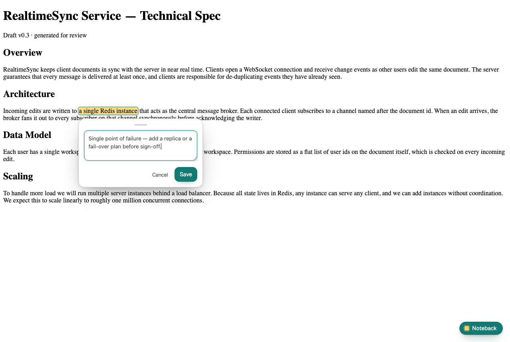
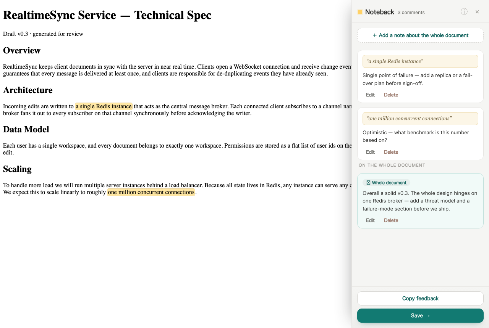

# Noteback

**Noteback** lets you review local AI-generated HTML documents — specs, plans,
design docs — right in your browser. Highlight a passage, attach a comment
anchored to that exact quote (or leave a note on the whole document), then **copy
your feedback as Markdown** to paste back to the AI, or **save a self-contained
"feedback canvas"** — one HTML file with your highlights and comments baked in
that anyone can open and comment on **without installing anything**.

It runs **100% locally**: no server, no account, no telemetry, no network calls.

> note it → send it back.

## What it looks like

**1. Select text → leave a comment.** A floating button opens a composer anchored
to the exact quote.



**2. The sidebar lists every comment** — anchored notes and notes on the whole
document — and lets you copy the feedback or save the canvas.



Comments use text-quote anchoring (W3C / Hypothesis style), so highlights survive
minor edits; a lost quote becomes an *unanchored* note instead of disappearing.
**Copy feedback** produces clean Markdown with line references; **Save** exports
the canvas with comments, a clean copy of the original, or a print-ready PDF.

## Install

You can use Noteback two ways — they share the same annotation engine. The
essentials are below; see [`docs/install.md`](docs/install.md) for every flag and
option.

### As an agent skill (no extension needed)

So an AI coding agent (Claude Code, Codex, …) can hand you documents that are
*already* annotatable: it writes the doc as HTML, wraps it with the CLI, and you
comment in the browser, then paste the Markdown back to iterate.

```sh
npx skills add alekkowalczyk/noteback   # pull the skill from GitHub → ./.claude/skills
npx noteback install-skill              # or install from npm → ~/.agents/skills + a ~/.claude symlink
```

The agent then runs `npx noteback wrap doc.html` to turn any HTML into a canvas.

### As a Chrome extension

1. Clone this repo.
2. Open `chrome://extensions` and enable **Developer mode** (top-right).
3. Click **Load unpacked** and select the repo root (the folder with
   `manifest.json`).
4. To annotate `file://` docs, open the extension's **Details** page and enable
   **"Allow access to file URLs."** (`localhost` / `127.0.0.1` need no toggle.)

## Docs

- [`docs/install.md`](docs/install.md) — full install & CLI reference: every
  `skills add` / `install-skill` / `wrap` flag, the extension steps, and
  permissions.
- [`docs/design.md`](docs/design.md) — the full design, motivation, positioning,
  privacy posture, and the one-runtime / two-modes architecture.
- [`CONTRACTS.md`](CONTRACTS.md) — runtime module API, State schema, runtime
  namespace, and the canvas file format.
- [`skills/noteback/SKILL.md`](skills/noteback/SKILL.md) — the agent skill itself.
- [`CLAUDE.md`](CLAUDE.md) — engineering notes, gotchas, permissions, and the
  two-registry distribution model (GitHub serves the skill, npm serves the CLI).

## Development

```sh
npm test   # runtime unit tests on the Node built-in runner (no deps, no framework)
```

## License

[MIT](LICENSE).
